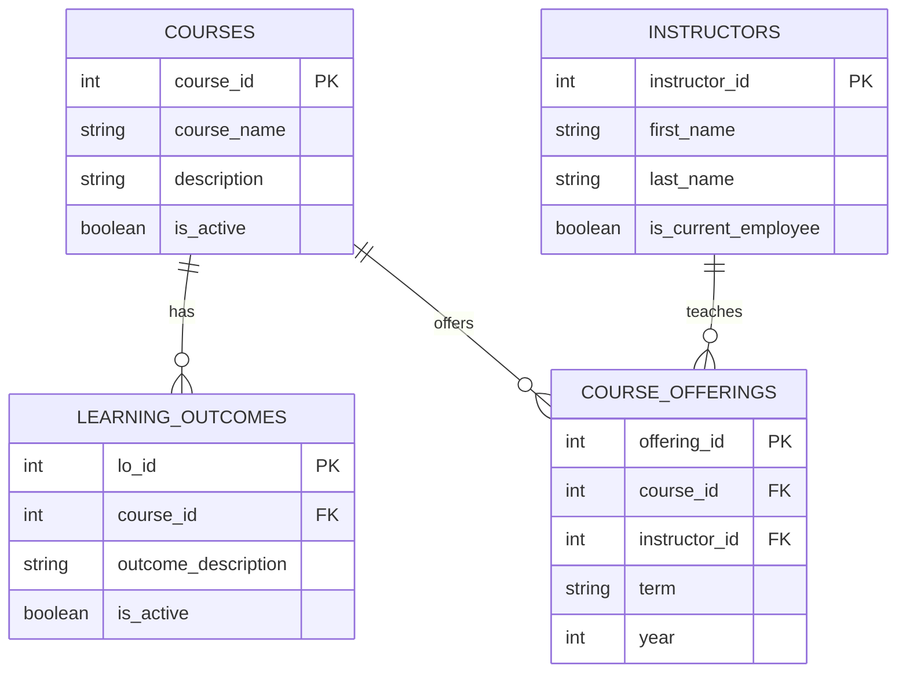

Here's an executive summary of the database design for the UVA SDS Online MSDS Program courses and curriculum:
1) The database will consist of the following main tables:
  - Courses
  - Learning_Outcomes
  - Instructors
  - Course_Offerings
2) Primary keys:
  - Courses: course_id
  - Learning_Outcomes: lo_id
  - Instructors: instructor_id
  - Course_Offerings: offering_id
3) Foreign keys:
  - Learning_Outcomes: course_id (references Courses)
  - Course_Offerings: course_id (references Courses), instructor_id (references Instructors)
4) Active/Inactive flags:
  - Courses: is_active boolean field
  - Learning_Outcomes: is_active boolean field
  - Instructors: is_current_employee boolean field
5) Normalization:
  - Separate tables for Courses, Learning_Outcomes, and Instructors to eliminate redundancy
6) Indexes:
  - On foreign key fields for improved query performance
7) Constraints:
  - Foreign key constraints to ensure data integrity
  - Check constraints on Course_Offerings to validate term and year
8) Relational Model:
  - A diagram is included below showing the tables, their fields, and relationships

9) Potential support for Residential MSDS Program:
  - To support the UVA SDS Residential MSDS Program in addition to the Online MSDS Program, several considerations and changes would be necessary for the database schema. 
Here's a detailed explanation of the potential issues, changes to the schema, and new data that might be needed:
Potential Issues
    - Program Differentiation: The database needs to distinguish between online and residential courses, learning outcomes, and instructors.
    - Course Offerings: Courses might be offered differently in the residential program compared to the online program (e.g., different terms, instructors, or formats).
    - Instructor Assignments: Instructors might teach in both programs, so their assignments need to be tracked separately for each program.
    - Learning Outcomes: Learning outcomes might differ between the online and residential versions of the same course.
-  Changes to the Database Structure (Schema)
    - Add Program Type: Introduce a new field program_type to relevant tables to differentiate between online and residential programs.
    - Modify Existing Tables:
      - Courses: Add a program_type field to indicate whether a course belongs to the online or residential program.
      - Course_Offerings: Add a program_type field to indicate the program for each course offering.
      - Learning_Outcomes: Add a program_type field to differentiate learning outcomes for the same course in different programs.
New Data Needed
  - Program Types: Define and store the types of programs (e.g., 'Online', 'Residential').
